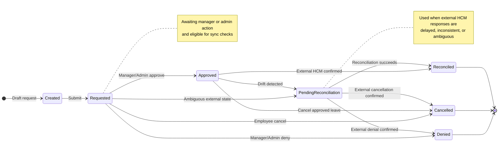

# Time-Off Microservice

A Python microservice for employee leave and time-off workflows. The service provides leave request APIs, manager approval flows, reconciliation with an HCM integration, script execution endpoints, deterministic seed data, and a local mock HCM adapter for development and testing.

## Features

- FastAPI application with health, leave, mock HCM, and script endpoints.
- SQLite-backed persistence using SQLAlchemy.
- Leave request lifecycle with employee, manager, and admin flows.
- Reconciliation logic for external HCM drift and ambiguous upstream responses.
- Local file-backed mock HCM adapter for deterministic development and test scenarios.
- Deterministic seed-data generation and local database initialization scripts.
- Unit, integration, API, and end-to-end test coverage.

### Other Documentation

- [Technical Requirements Document](docs/TRD.md)
- [Detailed API Specification](docs/API_SPEC.md)
- [Comprehensive Test Plan](tests/README.md)


## Repository layout

```text
src/
  adapters/      External HCM interfaces and provider (mock adapters for testing and simulated runs)
  api/           FastAPI routers and request/response schemas
  app/           App factory, config, dependencies, middleware, and exceptions
  auth/          Authentication and current-user resolution
  domain/        Domain enums, models, policies, and state machine logic
  infra/         Database, cache, HTTP, and jobs infrastructure
  repositories/  Persistence access layer
  services/      Business logic and orchestration
scripts/         Local database reset, seed, and seed-data generation scripts
seed_data/       Deterministic CSV and JSON seed inputs
tests/           Unit, integration, API, and end-to-end tests
```

## Requirements

- Python 3.12
- pip
- make (for Makefile targets)
- virtual environment support

## Quick start

### 1. Create and activate a virtual environment

```bash
python3 -m venv .venv
source .venv/bin/activate
```

### 2. Install dependencies

```bash
make install
```

This runs `pip install -e .[dev]` using the project's `pyproject.toml`.

### 3. Configure environment variables (optional)

The default local configuration works for SQLite-based development. You can override settings via environment variables:

```bash
export APP_ENV=local
export SQLITE_URL=sqlite:///./local.db
export DEFAULT_HCM_PROVIDER=mock_hcm
export ENABLE_RESPONSE_CACHE=false
export LOG_LEVEL=INFO
```

### 4. Generate deterministic seed data

```bash
make generate-seed-data
```

### 5. Reset and seed the local database

```bash
make reset-and-seed
```

Or run individually:
```bash
make reset-db
make seed
```

### 6. Start the API

```bash
make run
```

The service is available at: `http://127.0.0.1:8000`

## Leave request state flow



## Main endpoints

### Health

- `GET /api/v1/health`

### Leave APIs

- `GET /api/v1/leaves/balance`
- `GET /api/v1/leaves/current`
- `POST /api/v1/leaves/request`
- `GET /api/v1/leaves/manager/queue` (shows only requested, created, and pending_reconciliation by default; use `?include_all=true` to include all statuses)
- `POST /api/v1/leaves/{leave_id}/update`

### Script APIs

- `POST /api/v1/scripts/{name}/run`
- `POST /api/v1/scripts/{name}/schedule`
- `GET /api/v1/scripts/runs/{run_id}`
- `POST /api/v1/scripts/runs/{run_id}/cancel`

### Mock HCM APIs

- `GET /api/v1/mock-hcm/balances/{user_id}`
- `GET /api/v1/mock-hcm/leaves/{external_hcm_id}`
- `POST /api/v1/mock-hcm/leaves`
- `POST /api/v1/mock-hcm/leaves/{external_hcm_id}/update`
- `POST /api/v1/mock-hcm/scenarios/{scenario_name}`
- `POST /api/v1/mock-hcm/reload`
- `GET /api/v1/mock-hcm/state`

## Running tests

Run the full test suite:

```bash
make test
```

Run tests by layer:

```bash
make test-unit
make test-integration
make test-api
make test-e2e
```

Run linting and type checking:

```bash
make lint
make typecheck
```

## Local development workflow

A typical local workflow is:

```bash
make generate-seed-data
make reset-and-seed
make run
```

In another terminal:

```bash
make test
```

## Seed data

The project includes deterministic seed generation for:

- users,
- leave balances,
- leave requests,
- HCM configs,
- script runs,
- audit events,
- mock HCM external state.

Generated files are written under `seed_data/`.

## Authentication model

The application includes a lightweight role-based auth flow for local and test usage. The codebase supports employee, manager, and admin access patterns through dependency-based current-user resolution.

**Note on bearer tokens**: For the seeded development database and local simulation, the bearer token is simply the user ID (e.g., `user_emp_00001`, `user_mgr_0001`, `user_admin_001`). This is a simplification for deterministic seeding and testing.

In a production deployment, bearer tokens would be cryptographically signed JWTs or opaque tokens validated against an identity provider. Requests would also include an HMAC signature for request integrity verification. The current `TokenResolver` in `src/auth/tokens.py` can be extended to integrate with a real identity provider (e.g., OIDC, Keycloak, Auth0) by replacing the user-ID lookup with token validation and claims extraction.

## Sample curl commands (with seeded data)

After running `make reset-and-seed` and `make run`, you can test the API with these curl commands.

**Tip**: Append `| jq .` (if `jq` is installed) or `| python -m json.tool` to pretty-print JSON responses.

### Authentication

The token is the user ID from the seeded data. Common test users:

- Employee: `user_emp_00001` (manager: `user_mgr_0001`, location: `loc_us_ca`)
- Manager: `user_mgr_0001` (admin: `user_admin_001`, location: `loc_us_ca`)
- Admin: `user_admin_001` (location: `loc_us_ca`)

```bash
# Get balances for employee
curl -H "Authorization: Bearer user_emp_00001" \
  http://127.0.0.1:8000/api/v1/leaves/balance | jq .

# Request leave as employee (PTO, 2 days)
curl -X POST -H "Authorization: Bearer user_emp_00001" \
  -H "Content-Type: application/json" \
  -d '{
    "leave_type": "pto",
    "leave_duration": 2.0,
    "leave_start": "2026-09-10",
    "leave_end": "2026-09-11",
    "location_id": "loc_us_ca",
    "notes": "Family event"
  }' \
  http://127.0.0.1:8000/api/v1/leaves/request | jq .

# Get current leave requests for employee
curl -H "Authorization: Bearer user_emp_00001" \
  http://127.0.0.1:8000/api/v1/leaves/current | jq .

# Manager: list leave requests in their queue
curl -H "Authorization: Bearer user_mgr_0001" \
  http://127.0.0.1:8000/api/v1/leaves/manager/queue | jq .

# Manager: approve a leave request (replace LEAVE_ID with actual ID from queue)
curl -X POST -H "Authorization: Bearer user_mgr_0001" \
  -H "Content-Type: application/json" \
  -d '{
    "action": "approve",
    "leave_duration": 2.0,
    "leave_start": "2026-09-10",
    "leave_end": "2026-09-11",
    "notes": "Approved"
  }' \
  http://127.0.0.1:8000/api/v1/leaves/LEAVE_ID/update | jq .

# Manager: deny a leave request (replace LEAVE_ID with actual ID from queue)
curl -X POST -H "Authorization: Bearer user_mgr_0001" \
  -H "Content-Type: application/json" \
  -d '{
    "action": "deny",
    "leave_duration": 2.0,
    "leave_start": "2026-09-10",
    "leave_end": "2026-09-11",
    "notes": "Insufficient coverage"
  }' \
  http://127.0.0.1:8000/api/v1/leaves/LEAVE_ID/update | jq .

# Manager: deny an already approved leave request (requires mitigating_circumstances)
curl -X POST -H "Authorization: Bearer user_mgr_0001" \
  -H "Content-Type: application/json" \
  -d '{
    "action": "deny",
    "leave_duration": 2.0,
    "leave_start": "2026-09-10",
    "leave_end": "2026-09-11",
    "notes": "Business needs changed",
    "mitigating_circumstances": "Project deadline moved up, critical staffing shortage"
  }' \
  http://127.0.0.1:8000/api/v1/leaves/LEAVE_ID/update | jq .

# Admin: run a script
curl -X POST -H "Authorization: Bearer user_admin_001" \
  -H "Content-Type: application/json" \
  -d '{}' \
  http://127.0.0.1:8000/api/v1/scripts/sync_all_balances/run | jq .

# Admin: check script run status
curl -H "Authorization: Bearer user_admin_001" \
  http://127.0.0.1:8000/api/v1/scripts/runs/RUN_ID | jq .

# Mock HCM: get balances for a user
curl http://127.0.0.1:8000/api/v1/mock-hcm/balances/user_emp_00001 | jq .

# Mock HCM: create a leave in mock HCM
curl -X POST -H "Content-Type: application/json" \
  -d '{
    "user_id": "user_emp_00001",
    "location_id": "loc_us_ca",
    "leave_type": "pto",
    "leave_duration": 1.0,
    "leave_start": "2026-09-15",
    "leave_end": "2026-09-15",
    "approver_id": "user_mgr_0001"
  }' \
  http://127.0.0.1:8000/api/v1/mock-hcm/leaves | jq .

# Mock HCM: activate a scenario (e.g., ambiguous_success for testing reconciliation)
curl -X POST -H "Content-Type: application/json" \
  -d '{"enabled": true, "params": {"user_id": "user_emp_00001"}}' \
  http://127.0.0.1:8000/api/v1/mock-hcm/scenarios/ambiguous_success | jq .

# Health check
curl http://127.0.0.1:8000/api/v1/health | jq .
```

## Notes

- SQLite is used for local development and test flows.
- The mock HCM adapter persists state to local JSON so development scenarios remain reproducible.
- End-to-end tests cover request, approval, denial, cancellation, reconciliation, and scheduled balance sync flows.