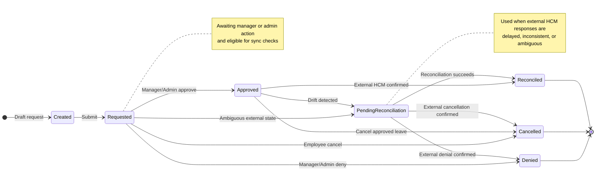

# Time-Off Microservice Technical Requirements Document

## 1. Document Information

- Project: Time-Off Microservice
- Primary stack: Python, FastAPI, SQLite
- Supporting libraries: SQLAlchemy, Pydantic, httpx, APScheduler, pytest

## 2. Overview

ReadyOn provides a backend service that allows employees to view leave balances and request time off while allowing managers to review and act on those requests. The external Human Capital Management system remains the source of truth for employment data and leave balances, and the service preserves local workflow usability while maintaining consistency with the HCM.

The main technical challenge is balance integrity. Employees request leave in ReadyOn while external systems can independently update HCM balances through accruals, refreshes, or corrections. The service therefore combines local request lifecycle management, real-time HCM interactions, batch synchronization, and defensive reconciliation when upstream validation is delayed, incomplete, or ambiguous.

## 3. Product Assumptions

- ReadyOn is the primary employee-facing interface for time-off workflows.
- The HCM is authoritative for employment data and balance values.
- Employees, managers, and admins access the service through authenticated API calls.
- Local persistence supports workflow continuity, auditability, and reconciliation.
- Mock HCM endpoints simulate external behavior for development and testing.

## 4. Goals

The service:

- authenticates employee, manager, and admin users
- exposes leave-related REST endpoints
- persists leave requests and local balance records in SQLite
- synchronizes with HCM through a canonical adapter layer
- provides resilient HTTP communication for HCM calls
- provides caching and rate-limit coordination
- supports scheduled reconciliation and backfill jobs
- includes an automated test suite for regression protection

## 5. Non-Goals

The service does not include:

- production single sign-on integration
- distributed message queues
- multi-region deployment
- production Redis cluster deployment
- production Airflow deployment
- payroll or compensation logic
- a user interface

## 6. Users and Roles

### Employee

An employee can:

- view an accurate leave balance
- request leave with immediate feedback
- view current and recent leave requests
- cancel or modify eligible requests

### Manager

A manager can:

- review pending leave requests for managed employees
- approve or deny requests with confidence that data is valid
- view relevant balances and request status before making decisions

### Admin

An admin can:

- perform privileged review and correction actions
- run reconciliation and maintenance scripts
- inspect system state during failures or support workflows

## 7. Functional Requirements

### 7.1 Authentication and Authorization

The system supports authenticated users with these personas:

- employee
- manager
- admin

All protected endpoints resolve a `LoggedInUser` object with at least:

- `user_id`
- `role`
- `manager_id`
- `location_id`

The authenticated user object exposes helper methods:

- `is_employee()`
- `is_manager()`
- `is_admin()`

Authorization rules:

- employees may access only their own leave data
- managers may act only on employees in their reporting tree
- admins may access all records
- all privileged actions are auditable

### 7.2 Leave Endpoints

Employee endpoints:

- `GET /leaves/balance`
- `GET /leaves/current`
- `POST /leaves/request`
- `POST /leaves/{leave_id}/update`

Manager endpoints:

- `GET /leaves/requests`
- `POST /leaves/{leave_id}/update`

### 7.3 Database

The system uses SQLite for local persistence.

Logical tables:

- `users`
- `leave_requests`
- `leave_balances`
- `hcm_configs`
- `script_runs`
- `audit_events`

Balances are maintained per employee per location.

### 7.4 HCM Adapter Layer

The system provides canonical methods:

- `get_balances(user_id, location_id=None)`
- `batch_get_balances(request)`
- `create_leave(user_id, leave_request)`
- `update_leave(actor_user_id, update_request)`

Provider-specific adapters convert canonical requests and responses into external formats.

### 7.5 HTTP Wrapper

The system provides an HTTP wrapper with methods:

- `get`
- `post`
- `put`
- `delete`

The wrapper supports:

- error normalization
- exponential backoff with jitter
- retry for transient failures
- rate-limit parsing from response headers
- typed upstream exceptions
- optional response caching for test or mock flows only

**Note:** for a real production deployment the HTTP wrapper would be used for all connections, including internal DB and caching, with a Connection Pooling and Context Management layers built on-top of it. This project currently only 

### 7.6 Cache Layer

The system provides:

- `get_key(namespace, key)`
- `set_key(namespace, key, value, ttl=None)`
- `delete_key(namespace, key)`
- `get_ratelimit(provider)`
- `acquire_ratelimit(provider, tokens=1)`
- `update_ratelimit_from_headers(provider, headers)`

The initial backend is in-memory, and the interface allows a later Redis-backed implementation.

### 7.7 Scheduling and Scripts

The service includes a scheduling and scripts module that supports:

- `run_script(name, params)`
- `schedule_script(name, cron_expression, params)`
- `get_status(run_id)`
- `cancel_run(run_id)`

Scheduling exists to keep local workflow data aligned with the HCM even when external changes occur outside a direct user request. The service uses scripts for batch balance synchronization, recent leave reconciliation, historical balance backfill, and repair of records that remain in reconciliation-required states.

Scripts run in two modes:

- regular scheduled execution for recurring synchronization and repair tasks
- ad hoc execution for operator-driven support, diagnostics, or corrective maintenance

Regular schedules are suitable for jobs such as periodic `sync_all_balances` and `reconcile_recent_leaves`. Ad hoc runs are suitable for targeted operations such as `repair_pending_reconciliation` or one-time `backfill_balances` after seed refreshes, support events, or external corrections.

The current scheduler uses APScheduler and persists script run status in `script_runs`. Scheduled syncs are the main automatic trigger path. Other scripts run when explicitly requested through the API or administrative workflows. For the sake of simplicity, the project does not create or mock any scheduled script runs.

### 7.8 Mock HCM

The service includes mock HCM endpoints with stateful logic to simulate:

- successful balance lookup
- successful leave creation
- insufficient balance
- invalid dimensions
- delayed consistency
- independent balance refresh events
- intermittent validation gaps

### 7.9 Testing

The service includes:

- unit tests
- integration tests
- API tests
- end-to-end tests

The test suite validates synchronization, authorization, state transitions, retries, rate-limits, and reconciliation behavior.

## 8. Non-Functional Requirements

### Correctness

Correctness is the highest priority. The service does not silently accept inconsistent state between local data and HCM. If final truth is uncertain, the system marks the record for reconciliation.

### Testability

Infrastructure dependencies are injectable or replaceable in tests. Service boundaries remain narrow and explicit.

### Maintainability

The codebase is structured into modules with one primary responsibility each. Domain logic does not duplicate route or repository behavior.

### Observability

The system logs:

- request identifiers
- user identifiers
- leave request identifiers
- HCM provider identifiers
- external request identifiers
- script run identifiers
- transition and error outcomes

Sensitive actions produce audit events.

## 9. Architecture

The service is implemented as a modular monolith.

Top-level architectural areas:

- API layer
- auth layer
- domain layer
- service layer
- repository layer
- adapter layer
- infrastructure layer
- jobs layer
- mock HCM layer
- tests

### 9.1 API Layer

Responsible for:

- HTTP routing
- request validation
- response serialization
- dependency wiring
- exception mapping

The API layer remains thin and delegates business behavior to services.

### 9.2 Auth Layer

Responsible for:

- resolving authenticated users
- role-aware dependencies
- helper methods for current-user checks

The auth layer does not contain leave business rules.

### 9.3 Domain Layer

Responsible for:

- leave status definitions
- state transition rules
- business policy validation
- canonical domain models

The domain layer is pure and testable without HTTP or database dependencies.

### 9.4 Service Layer

Responsible for orchestration:

- leave request creation
- leave updates
- balance reads and updates
- reconciliation
- audit emission
- script execution logic

### 9.5 Repository Layer

Responsible for persistence only:

- querying users
- querying and updating leave requests
- querying and upserting balances
- persisting script runs
- persisting audit events

### 9.6 Adapter Layer

Responsible for:

- canonical HCM interfaces
- provider-specific request mapping
- provider-specific response mapping

### 9.7 Infrastructure Layer

Responsible for:

- database session management
- HTTP client implementation
- retry policy
- cache backend
- rate-limit support

### 9.8 Jobs Layer

Responsible for:

- scheduled execution
- script registration
- run tracking
- reconciliation orchestration

### 9.9 Mock HCM Layer

Responsible for:

- upstream simulation for tests
- scenario switching
- stateful external truth models

## 10. Data Model

### users

```sql
TABLE users (
    id              TEXT PRIMARY KEY,
    email           TEXT NOT NULL,
    name            TEXT NOT NULL,
    role            TEXT NOT NULL,
    manager_id      TEXT NULL REFERENCES users(id),
    location_id     TEXT NOT NULL,
    is_active       BOOLEAN NOT NULL,
    created_ts      DATETIME NOT NULL,
    updated_ts      DATETIME NOT NULL
);

INDEX idx_users_role (role);
INDEX idx_users_manager_id (manager_id);
INDEX idx_users_location_id (location_id);
```

### leave_requests

```sql
TABLE leave_requests (
    id                TEXT PRIMARY KEY,
    external_hcm_id   TEXT NULL,
    requestor_id      TEXT NOT NULL REFERENCES users(id),
    approver_id       TEXT NULL REFERENCES users(id),
    location_id       TEXT NOT NULL,
    leave_type        TEXT NOT NULL,
    leave_duration    FLOAT NOT NULL,
    leave_start       DATE NOT NULL,
    leave_end         DATE NOT NULL,
    status            TEXT NOT NULL,
    failure_reason    TEXT NULL,
    version           INTEGER NOT NULL,
    created_ts        DATETIME NOT NULL,
    updated_ts        DATETIME NOT NULL,
    approved_ts       DATETIME NULL,
    complete_ts       DATETIME NULL,
    last_synced_ts    DATETIME NULL
);

INDEX idx_leave_requests_requestor_id (requestor_id);
INDEX idx_leave_requests_approver_id (approver_id);
INDEX idx_leave_requests_status (status);
INDEX idx_leave_requests_external_hcm_id (external_hcm_id);
INDEX idx_leave_requests_location_id (location_id);
```

### leave_balances

```sql
TABLE leave_balances (
    id                  TEXT PRIMARY KEY,
    user_id             TEXT NOT NULL REFERENCES users(id),
    location_id         TEXT NOT NULL,
    leave_type          TEXT NOT NULL,
    num_available       FLOAT NOT NULL,
    num_ytd_taken       FLOAT NOT NULL,
    num_limit           FLOAT NOT NULL,
    external_updated_ts DATETIME NULL,
    updated_ts          DATETIME NOT NULL
);

UNIQUE INDEX uq_leave_balances_user_location_type (
    user_id,
    location_id,
    leave_type
);

INDEX idx_leave_balances_user_id (user_id);
INDEX idx_leave_balances_location_id (location_id);
```

### hcm_configs

```sql
TABLE hcm_configs (
    id                  TEXT PRIMARY KEY,
    provider_name       TEXT NOT NULL,
    base_url            TEXT NOT NULL,
    auth_type           TEXT NOT NULL,
    token_ref           TEXT NOT NULL,
    rate_limit_default  INTEGER NOT NULL,
    is_active           BOOLEAN NOT NULL,
    created_ts          DATETIME NOT NULL,
    updated_ts          DATETIME NOT NULL
);

INDEX idx_hcm_configs_provider_name (provider_name);
INDEX idx_hcm_configs_is_active (is_active);
```

### script_runs

```sql
TABLE script_runs (
    id                   TEXT PRIMARY KEY,
    script_name          TEXT NOT NULL,
    status               TEXT NOT NULL,
    schedule_expression  TEXT NULL,
    params_json          TEXT NOT NULL,
    started_ts           DATETIME NULL,
    finished_ts          DATETIME NULL,
    cancel_requested     BOOLEAN NOT NULL,
    error_message        TEXT NULL
);

INDEX idx_script_runs_script_name (script_name);
INDEX idx_script_runs_status (status);
```

### audit_events

```sql
TABLE audit_events (
    id             TEXT PRIMARY KEY,
    entity_type    TEXT NOT NULL,
    entity_id      TEXT NOT NULL,
    action         TEXT NOT NULL,
    actor_user_id  TEXT NOT NULL,
    payload_json   TEXT NOT NULL,
    created_ts     DATETIME NOT NULL
);

INDEX idx_audit_events_entity_type_entity_id (entity_type, entity_id);
INDEX idx_audit_events_actor_user_id (actor_user_id);
INDEX idx_audit_events_action (action);
```

## 11. Leave Lifecycle and State Machine

### Leave status enums

```text
created
requested
approved
denied
complete
canceled
pending_reconciliation
```

### Allowed transitions

```text
created -> requested
requested -> approved
requested -> denied
requested -> canceled
approved -> canceled
approved -> complete
any -> pending_reconciliation
pending_reconciliation -> approved
pending_reconciliation -> denied
pending_reconciliation -> canceled
pending_reconciliation -> complete
```



The state machine is implemented explicitly and covered by direct tests.

## 12. API Endpoints

```text
GET /leaves/balance
```

Returns balances for the authenticated user. Results are scoped by user and location context.

```text
GET /leaves/current
```

Returns current and recent leave requests for the authenticated user.

```text
POST /leaves/request
```

Creates a leave request. The request is validated for ownership, leave type, date range, duration, and balance/HCM constraints before the local record is persisted and audited.

```text
POST /leaves/{leave_id}/update
```

Applies an employee, manager, or admin action depending on role and target state. Employee actions include cancel or modify behavior where policy allows it. Manager actions include approve, deny, or request-change-style workflow transitions. Admin actions support overrides, correction, and repair flows.

```text
GET /leaves/requests
```

Returns a manager-scoped or admin-scoped list of leave requests.

```text
POST /scripts/{name}/run
```

Runs a registered script immediately with provided parameters and persists a `script_runs` record for status tracking.

```text
POST /scripts/{name}/schedule
```

Schedules a registered script using a cron expression for recurring execution.

```text
GET /scripts/runs/{run_id}
```

Returns the current persisted status of a script run.

```text
POST /scripts/runs/{run_id}/cancel
```

Persists cancellation intent for a running or pending script.

## 13. Canonical HCM Interface

The canonical HCM interface is defined as a Python protocol.

Required methods:

- `get_balances`
- `batch_get_balances`
- `create_leave`
- `update_leave`

This interface isolates domain and service layers from provider-specific details.

## 14. Error Handling

The API returns a stable JSON error envelope:

```json
{
  "code": "STRING_CODE",
  "message": "Human readable message",
  "details": {},
  "request_id": "uuid-or-similar"
}
```

Representative error codes:

```text
AUTH_REQUIRED
ACCESS_DENIED
VALIDATION_ERROR
INVALID_STATE_TRANSITION
INSUFFICIENT_BALANCE
UPSTREAM_TIMEOUT
UPSTREAM_RATE_LIMITED
UPSTREAM_VALIDATION_ERROR
RECONCILIATION_REQUIRED
```

## 15. Logging and Audit

Each request carries a request identifier.

Structured logs include, where applicable:

```text
request_id
user_id
role
leave_request_id
provider
external_request_id
script_run_id
action
result
latency_ms
```

Audit events are written for:

- leave creation
- approval
- denial
- cancellation
- admin overrides
- reconciliation outcomes

## 16. Seeded Data

The seeded dataset includes:

- about 5000 employees
- one or two leave types
- manager relationships for all employees except one top-level exception
- multiple locations
- seeded balances per user and location
- seeded leave requests across several statuses
- seeded HCM config records

Mock HCM data is maintained separately so local and external states can diverge during tests.

## 17. Scheduling and Scripts

Built-in scripts:

- `sync_all_balances`
- `reconcile_recent_leaves`
- `backfill_balances`
- `repair_pending_reconciliation`

These scripts exist to keep local balances and leave statuses aligned with the HCM even when external changes happen outside the request path. They also support operational recovery after delayed upstream updates, failed validations, or manual corrections.

Scheduling falls into two categories:

- regular scheduled runs for recurring synchronization and reconciliation
- ad hoc runs for investigation, support, backfill, and repair

Regular scheduled runs are appropriate for balance synchronization and recent-leave reconciliation. Ad hoc runs are appropriate for targeted repair of reconciliation-required records, selective backfills, or support-driven maintenance after external incidents.

Each script run persists a `script_runs` record, including run status, scheduling metadata, parameters, timestamps, and cancellation intent. Automatic triggers mainly consist of recurring scheduled sync jobs. Other maintenance and repair actions are initiated explicitly through script endpoints or operator workflows.

## 18. Acceptance Criteria

### Authentication and Authorization

- unauthenticated requests to protected routes return 401
- employee users can act only on their own leave records
- manager users can act only on managed employees
- admin users can access all leave and script routes

### Leave Lifecycle

- valid leave request persists and calls the HCM adapter
- invalid leave type or date range fails validation
- invalid state transitions are rejected
- uncertain HCM outcomes move the leave request to `pending_reconciliation`

### Balances and Sync

- balances are unique per employee, location, and leave type
- real-time balance lookup is supported
- batch balance synchronization is supported
- reconciliation repairs local state after external balance changes

### Adapter and HTTP Wrapper

- canonical adapter hides provider-specific payloads
- retry and backoff behavior is covered by tests
- rate-limit headers are parsed and persisted through cache
- response caching is disabled by default and used only for tests or mock flows

### Scheduling

- scripts can run ad hoc
- scripts can be scheduled
- script status can be queried
- cancellation requests are persisted
- reconciliation jobs run end-to-end in tests

### Testing

- unit, integration, API, and end-to-end tests are present
- mock HCM endpoints support scenario simulation
- coverage thresholds are enforced in CI

## 19. Alternatives Considered

### Flask and Django

Flask and Django were both considered as Python web framework options. Flask aligns well with lightweight decorator-based patterns, while Django provides a more batteries-included platform. FastAPI is the better fit for this service because it provides stronger request validation, dependency injection, typed schemas, and test override support without adding framework surface area that is unrelated to the sync and reconciliation problem.

### Event-Driven Queue-First Architecture

A queue-first design may improve scalability but adds complexity and weakens immediate request feedback for employees. For this scope, synchronous orchestration plus reconciliation jobs is the preferred tradeoff.

## 20. Risks and Mitigations

### Local and HCM state drift

This risk appears when local records and the external HCM no longer agree because of delayed updates, external accruals, or partial failures. Mitigation includes reconciliation status, scheduled sync jobs, audit events, and explicit sync timestamps.

### Race conditions between approval and cancellation

This risk appears when concurrent actions attempt to update the same leave request in conflicting ways. Mitigation includes optimistic concurrency with version fields, deterministic update rules, and conflict-aware tests.

### Manager hierarchy bugs

This risk appears when authorization logic incorrectly determines who can act on whose records. Mitigation includes isolated hierarchy repository methods and direct unit and integration tests.

### Retry or rate-limit logic misbehavior

This risk appears when retry loops, backoff timing, or rate-limit parsing produce hidden failures or overload. Mitigation includes dedicated HTTP wrapper tests plus deterministic fake headers and clocks.

### Over-mocking

This risk appears when tests validate mocked behavior but fail to represent real persistence and orchestration behavior. Mitigation includes real SQLite integration tests and end-to-end flows using mock HCM routes.